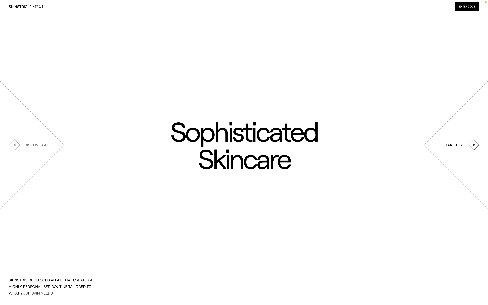
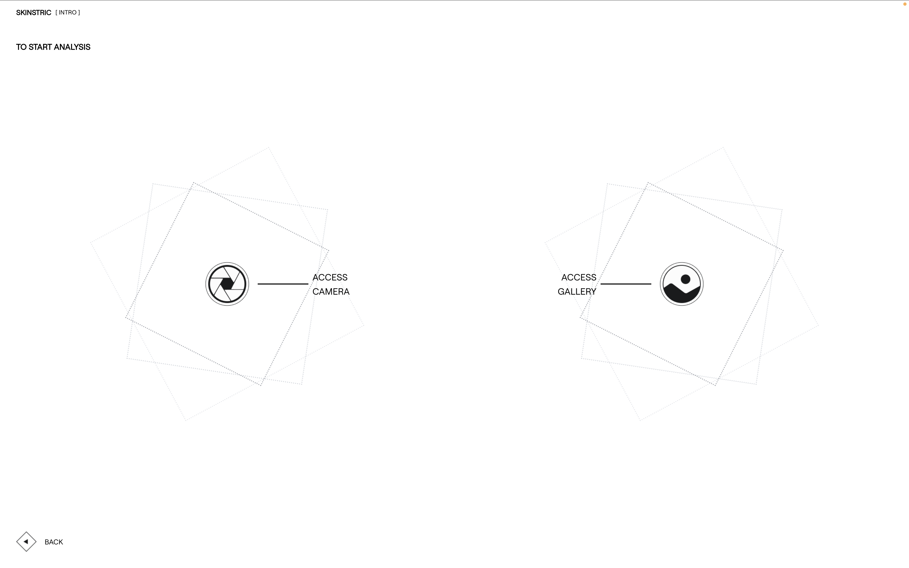
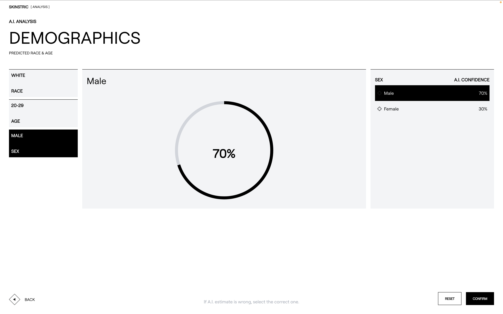

# Skinstric

> Sophisticated skincare, powered by A.I.




---

## About

Skinstric is a web application that uses AI to analyze your skin from a photo and generate a personalized skincare profile. The experience guides users through a short questionnaire, captures or uploads a photo, and then presents AI-predicted demographic data, including estimated race, age range, and sex, with confidence scores that the user can review and correct.

The project was bootstrapped from `create-next-app` and built on top of that foundation. The frontend is a sequential wizard-style flow; all AI inference runs on a hosted Google Cloud Functions backend, keeping the Next.js app entirely client-side.

The design language is minimal and editorial. A custom variable font (Roobert TRIAL), rotating dotted-diamond animations, and a black-and-white palette give the experience a considered, premium feel.

---

## Features



- **Multi-step onboarding flow** — collects user name and location before analysis begins
- **Dual photo input** — take a live photo via webcam or upload from gallery
- **Camera permission gating** — verifies camera access before navigating to the capture screen
- **AI demographic analysis** — sends base64-encoded image to a cloud API and receives predicted race, age, and gender with percentage confidence scores
- **Interactive demographics review** — users can override any AI prediction before confirming
- **Animated UI** — layered rotating dotted-diamond spinners at varying speeds throughout the flow
- **Responsive layout** — separate desktop (≥1280px) and mobile layouts on the landing page; fluid adjustments on inner pages

---

## Tech Stack

| Category   | Technology                        |
|------------|-----------------------------------|
| Framework  | Next.js 15.3.3 (Pages Router)     |
| UI Library | React 19.0.0                      |
| Styling    | Tailwind CSS 3.4.17               |
| Font       | Roobert TRIAL (self-hosted woff2) |
| Backend    | Google Cloud Functions (external) |
| Linting    | ESLint 9.28.0 + eslint-config-next|

---

## Project Structure

```
my-next-app/
├── public/
│   └── assets/              # Icons, button images, font files
│       └── fonts/
│           └── RoobertTRIALVF.woff2
├── src/
│   ├── components/
│   │   ├── Header.jsx       # Logo + current section label, links home
│   │   ├── LeftButton.jsx   # Back navigation button (image + label)
│   │   └── RightButton.jsx  # Forward navigation button (image + label)
│   ├── pages/
│   │   ├── _app.js          # Global style imports
│   │   ├── _document.js     # HTML document shell
│   │   ├── index.js         # Landing page — "Sophisticated Skincare"
│   │   ├── testing.jsx      # Step 1: name + location questionnaire
│   │   ├── analysis.jsx     # Step 2: choose camera or gallery
│   │   ├── camera.jsx       # Step 3a: live webcam capture
│   │   ├── select.jsx       # Step 3b: analysis category selection hub
│   │   ├── demographics.jsx # Step 4: review AI-predicted demographics
│   │   └── api/
│   │       └── hello.js     # Unused starter API route
│   └── styles/
│       ├── globals.css      # Tailwind directives + Roobert font-face
│       └── animations.css   # Spinning diamond keyframe classes
├── next.config.mjs
├── tailwind.config.js
└── jsconfig.json            # Path alias: @/* → src/*
```

---

## Getting Started

### Prerequisites

- Node.js 18+
- npm

### Install & Run

```bash
git clone <repo-url>
cd my-next-app
npm install
npm run dev
```

Open [http://localhost:3000](http://localhost:3000).

### Other Commands

```bash
npm run build   # Production build
npm run start   # Serve production build
npm run lint    # Run ESLint
```

---

## Environment Variables

This project has no `.env` variables — all external API endpoints are hardcoded directly in the source. The two Google Cloud Functions URLs used are:

| Endpoint | Used In | Purpose |
|----------|---------|---------|
| `https://us-central1-api-skinstric-ai.cloudfunctions.net/skinstricPhaseOne` | `testing.jsx` | Submits user name + location |
| `https://us-central1-api-skinstric-ai.cloudfunctions.net/skinstricPhaseTwo` | `analysis.jsx`, `camera.jsx` | Submits base64 image for AI analysis |

---

## Architecture / How It Works



1. **Intro (`/`)** — Static landing page. The "DISCOVER A.I." button is intentionally disabled (`cursor-not-allowed`); only "TAKE TEST" is active.
2. **Testing (`/testing`)** — Two-question form (name → location). On submission, POSTs to `skinstricPhaseOne` and saves the answers to `localStorage`, then navigates to `/analysis`.
3. **Analysis (`/analysis`)** — User picks camera or gallery. Gallery upload base64-encodes the image, calls `skinstricPhaseTwo`, stores the JSON response in `sessionStorage`, and routes to `/select`. Camera access is permission-gated and routes to `/camera`.
4. **Camera (`/camera`)** — Live `<video>` feed via `getUserMedia`. On capture, a `<canvas>` draws the frame, encodes it to PNG base64, and the same `skinstricPhaseTwo` flow runs.
5. **Select (`/select`)** — Diamond-grid navigation hub. Only the DEMOGRAPHICS tile is wired up; the others (`COSMETIC CONCERNS`, `SKIN TYPE DETAILS`, `WEATHER`) are placeholder stubs.
6. **Demographics (`/demographics`)** — Reads `demographicData` from `sessionStorage`. Displays AI confidence scores for race, age, and gender as interactive lists with an SVG donut chart. User can override selections, then confirm.

Cross-page state travels via browser storage (`localStorage` for the user profile, `sessionStorage` for analysis results) — no state management library is used.

---

## Live Demo

No deployed URL was found in the project configuration.

---

## License & Contact

This project is private (`"private": true` in `package.json`). No license file is included.
